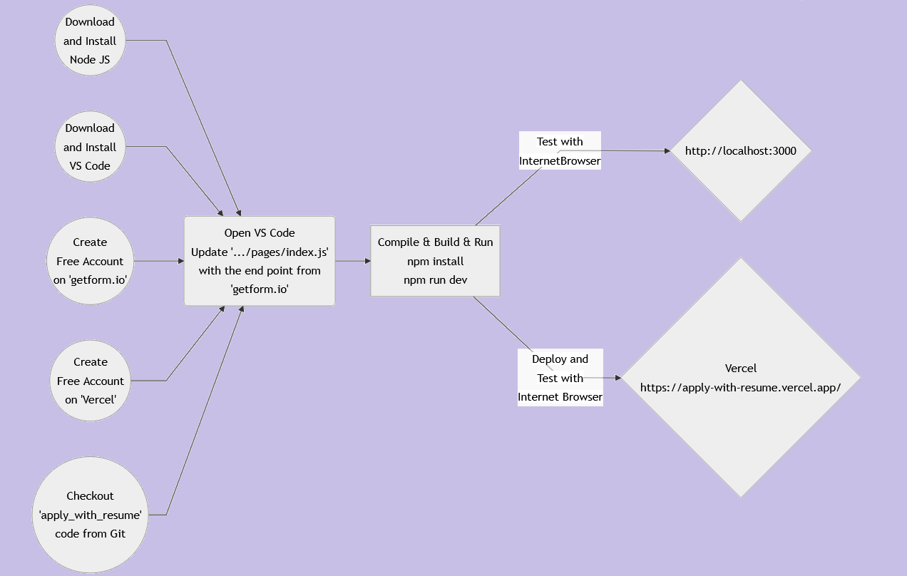

# Step by Step Tutorial to Create a Simple Web Application to Upload IT Job Skills using Next JS

### Workflow

### Getting Started
<ul>
<li>Checkout <a href="https://github.com/lalumastan/apply_with_resume.git">this code</a> from Github</li>
<li>Create a free account on <a href="https://getform.io">getform.io</a></li> 
<li>Update <code>GETFORM_FORM_ENDPOINT</code> in <code>.../pages.index.js</code> </li>
<li>Compile and build the code using <code>npm install</code></li>
<li>Run the development server using <code>npm run dev</code></li>
 <li>Open <a href="http://localhost:3000">http://localhost:3000</a> with your browser to see the result.</li>
 <li>You can start editing the page by modifying <code>.../pages/index.js</code>. The page auto-updates as you edit the file.</li>
</ul>

This project uses [`next/font`](https://nextjs.org/docs/basic-features/font-optimization) to automatically optimize and load Inter, a custom Google Font.

### Deploy on Vercel

The easiest way to deploy your Next.js app is to use the [Vercel Platform](https://vercel.com/new?utm_medium=default-template&filter=next.js&utm_source=create-next-app&utm_campaign=create-next-app-readme) from the creators of Next.js.

Check out our [Next.js deployment documentation](https://nextjs.org/docs/deployment) for more details.

### References
<ul>
 <li><a href="https://nextjs.org/learn">Interactive Next.js tutorial</a></li>
 <li><a href="https://nextjs.org/docs">Next.js Documentation</a></li>
 <li><a href="https://reactjs.org/">React</a></li> 
 <li><a href="https://vercel.com">Vercel</a></li>
 <li><a href="https://getform.io">Smart  form endpoints  for developer</a></li>
</ul>

### Tutorial

